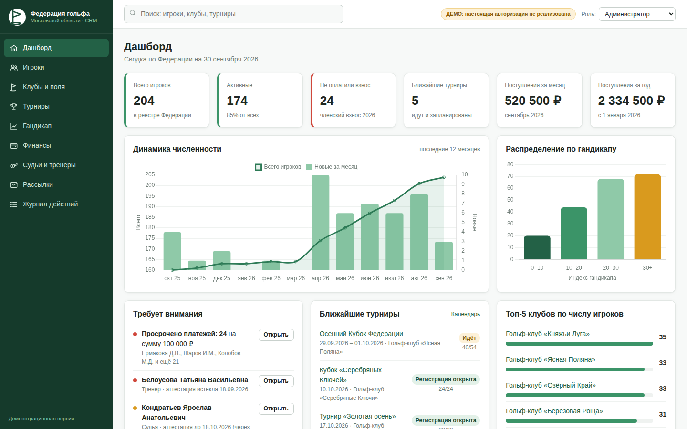

# Golf Federation of Moscow Oblast — CRM (demo)

A **presentation prototype** of a CRM for the Golf Federation of Moscow Oblast
(«Федерация гольфа Московской области»). The goal is to show in ~10 minutes what the
system looks like and what it can do. The UI is entirely in Russian. All data is
fictional («Все данные вымышлены»).



> This is **not** a production system: there is no real authentication, payments and
> mailings are simulated, and the handicap calculation is a simplified demo version
> (see [Handicap](#handicap-simplified-demo-implementation)).

## Quick start

Requirements: **Python 3.11+**. No internet connection is needed at runtime: htmx and
Chart.js are stored in `app/static/vendor`, there are no CDN links or web fonts.

### Windows (PowerShell or cmd)

```bat
cd golf_crm
py -3.11 -m venv .venv
.venv\Scripts\activate
pip install -r requirements.txt
python run.py
```

### macOS / Linux

```bash
cd golf_crm
python3 -m venv .venv
source .venv/bin/activate
pip install -r requirements.txt
python run.py
```

`python run.py` creates `golf_crm.db` (SQLite) and fills it with demo data on the
first run, starts the server and opens <http://localhost:8000> in the browser.
Stop it with `Ctrl+C`.

Options:

| Command | Effect |
|---|---|
| `python run.py --reset` | recreate the database with fresh demo data (do this before a presentation) |
| `python run.py --no-browser` | do not open the browser |
| `python run.py --port 8080` | use another port |
| `python seed.py` | only regenerate the database |

### Tests

```bash
python -m pytest -q
```

## Screens

| Section | What it shows |
|---|---|
| **Дашборд** | KPI cards (players, active, unpaid, upcoming tournaments, revenue for month/year), member count chart (12 months), handicap distribution (0–10/10–20/20–30/30+), top-5 clubs, upcoming tournaments, a "needs attention" block (overdue fees, referee certifications expiring/expired, tournaments that reached their limit). |
| **Игроки** | Table with search, filters (club, status, age category, handicap range), column sorting, pagination (live via htmx), CSV export of the current selection (UTF-8 with BOM, `;`, opens correctly in Excel). Player card with tabs: profile, handicap (index history chart, rounds with counted differentials, add round, recalculate), tournaments, payments, notes. Create / edit with validation, status change. |
| **Клубы и поля** | Club list, club card with contacts, players, courses and tee parameters (Course Rating / Slope / Par for white, yellow, blue, red tees), tournaments on its courses. |
| **Турниры** | List and monthly calendar. Tournament card: overview, registrations (confirm / waitlist / reject / mark fee paid; automatic waitlist when the limit is reached, automatic promotion when a slot frees up), result entry, automatic totals and positions, leaderboard with category standings. Printable start protocol (tee times, groups) and final protocol as separate print-styled pages. Status workflow: draft → registration → in progress → finished (or cancelled). |
| **Гандикап** | All players with stored vs. recalculated index, "needs recalculation" filter, bulk recalculation. Single-player recalculation lives in the player card. |
| **Финансы** | Payment list with filters and CSV export, debtors (current-year membership fee unpaid) with "mark as paid", monthly summary (stacked chart + table), new payment form. |
| **Судьи и тренеры** | List with filters by role, warnings for certifications that expire in less than 60 days or have expired, create / edit. |
| **Рассылки** | Segment selection (everyone, debtors, juniors, seniors, club X, participants of tournament Y), live recipient preview, simulated sending, history. |
| **Журнал действий** | Audit log with filters by user (demo role) and action type. |
| Header | Global search (players, clubs, tournaments) with a dropdown, demo role switcher and the badge «ДЕМО: настоящая авторизация не реализована». |

Screenshots are in [`docs/screenshots`](docs/screenshots).

## Suggested 10-minute demo

1. **Dashboard**: the KPIs and the "Требует внимания" block.
2. **Игроки**: filter by "Не оплачен взнос", sort by handicap, export CSV and open it in Excel. Open a player → tab **Гандикап** (chart, counted rounds).
3. **Турниры → Осенний Кубок Федерации** (in progress): tab **Ввод результатов**, fill in a few round 2/3 scores → **Лидерборд** recalculates → **Промежуточный протокол** (print page) → **Завершить турнир** (rounds go to the handicap history).
4. **Турниры → Кубок «Серебряных Ключей»** (full, with waitlist): add an application → it goes to the waitlist; reject a confirmed player → the first waitlisted player is promoted.
5. **Финансы → Должники**: mark a fee as paid → the player's status becomes "Активен".
6. **Рассылки → Новая рассылка**: segment "Должники", see the preview (players without consent are excluded), "send".
7. **Журнал действий**: every step above is logged.
8. Switch the role to **Бухгалтер** in the header: the menu shrinks, player data becomes read-only.

Run `python run.py --reset` afterwards to restore the initial data.

## Demo roles

There is **no real authentication**: the role is chosen in the header and stored in a
cookie. The UI shows the badge «ДЕМО: настоящая авторизация не реализована».

| Role | Access |
|---|---|
| Администратор (admin) | everything, including mailings, referees/coaches and the audit log |
| Секретарь турниров (secretary) | dashboard, players (edit), tournaments (edit), handicap (recalculate), clubs (view) |
| Бухгалтер (accountant) | dashboard, finance (edit), players (read-only) |

Access is enforced on the server (HTTP 403 page), not only by hiding menu items.

## Handicap: simplified demo implementation

`app/services/handicap.py` implements a **simplified demo calculation inspired by the
World Handicap System. It is NOT a certified calculation under R&A/USGA rules.**

- Differential = (113 / Slope) × (Adjusted Gross Score − Course Rating), rounded half up to 0.1.
- Index = average of the best 8 of the most recent 20 differentials.
- With fewer than 20 rounds: 3 → lowest − 2.0; 4 → lowest − 1.0; 5 → lowest; 6 → average of lowest 2 − 1.0;
  7–8 → lowest 2; 9–11 → lowest 3; 12–14 → lowest 4; 15–16 → lowest 5; 17–18 → lowest 6; 19 → lowest 7.
- Index is clamped to 0.0–54.0. Course handicap = Index × Slope / 113 + (Course Rating − Par).

Not implemented: hole-by-hole net double bogey adjustment (the entered gross is treated
as the adjusted gross score), Playing Conditions Calculation, soft/hard cap, exceptional
score reduction, 9-hole score combination, plus handicaps.

## Assumptions (Допущения)

Decisions made where the brief was silent:

1. **Location.** The repository already contained an unrelated project, so the CRM lives in the self-contained `golf_crm/` folder. Run all commands from inside it.
2. **Demo dates are relative to the first run.** The seed places tournaments, payments and rounds around "today" so there is always a tournament in progress, open registrations etc. The random seed is fixed (`config.SEED`), so the data is identical for a given run date.
3. **License number** `MO-<current year>-<NNNN>`: numbered by seniority in the seed; new players get the next free number. It never changes.
4. **Age category** is computed on today's date: juniors ≤ 17, seniors ≥ 50. For tournaments the category is computed on the tournament start date.
5. **Membership fee** is annual per calendar year (5 000 ₽ adults, 2 500 ₽ juniors and seniors — `app/config.py`). The invoice is issued on 15 January or on the join date, with a 30-day term. A player gets the status "Не оплачен взнос" when the current-year invoice is overdue; marking it paid restores "Активен". A new player automatically gets a current-year invoice. "Debtors" = current-year membership invoice pending or overdue. Pending invoices past their due date become overdue on application start.
6. **Registration limit.** Both "Заявка" and "Подтверждена" occupy a slot. When the limit is reached new applications go to the waitlist. When a slot frees up (reject / move to waitlist) or the limit is raised, the earliest waitlisted application becomes "Заявка". Registration is only possible while the tournament is "Регистрация открыта" and before the deadline; suspended players cannot register.
7. **Tournament fees.** An invoice is created with the application (not for the waitlist). Rejecting or waitlisting deletes an unpaid invoice; if the fee was already paid the UI asks to arrange a refund manually.
8. **Results** are entered only for confirmed players and only while the tournament is "Идёт". The course handicap is fixed at the first entry. Finishing the tournament locks results, posts every round to the players' handicap history and recalculates their indexes.
9. **Stableford** points are estimated from round totals (no hole-by-hole scores): `max(0, 36 + par + course handicap − gross)` per round.
10. **Ranking:** ties share a position (shown as "T5"); while a tournament is in progress players with more rounds played rank higher.
11. **Scoring category** priority: juniors → seniors → gender (if the tournament has such a category).
12. **Tees:** by default men play yellow and women red; in the seed, low handicappers (< 8) play white/blue. 9-hole courses carry ratings for 18 holes (two loops).
13. **Dates are typed as text in DD.MM.YYYY** (with an input mask) instead of native date pickers, because native pickers display the browser's locale format (e.g. MM/DD/YYYY).
14. **Clubs and courses are read-only** in the UI (seeded). Players and tournaments are never deleted through the UI (players are suspended, tournaments cancelled) to keep the audit trail consistent; the only deletion is an unpaid tournament invoice when its application is rejected.
15. **Audit "who"** is the demo role name, since there are no user accounts. Role switches are logged too.
16. **Mailings** only reach players with personal-data consent and an e-mail; excluded players are listed in the preview. Sending writes the message to the database, the audit log and `logs/mailings.log` (recipient list). Nothing is sent.
17. **Money** is stored in whole rubles.
18. **Styling:** one hand-written CSS file instead of Tailwind (no build step). The layout adapts to tablet width (collapsed icon sidebar) and phone width (hidden sidebar with a menu button).
19. The server listens on `127.0.0.1` only.

## Project structure

```
golf_crm/
├── run.py                  # one-command start: create + seed DB, run server, open browser
├── seed.py                 # reproducible fictional demo data (Faker ru_RU, fixed seed)
├── requirements.txt
├── app/
│   ├── config.py           # fees, age limits, page size, seed, paths
│   ├── db.py               # SQLAlchemy engine/session, Cyrillic-aware SQLite helpers
│   ├── labels.py           # Russian UI labels for stored codes
│   ├── main.py             # FastAPI app, error pages, body size limit
│   ├── web.py              # templates, filters, demo roles/access, flash messages
│   ├── models/             # ORM models
│   ├── services/
│   │   ├── handicap.py     # differential, index, course handicap (simplified demo)
│   │   ├── leaderboard.py  # totals, positions, categories, boards
│   │   ├── registration.py # participant limit and waitlist
│   │   ├── segmentation.py # mailing segments
│   │   ├── payments.py     # fee amounts, mark paid, overdue refresh
│   │   ├── tournaments.py  # status transitions, posting rounds to handicap
│   │   ├── audit.py
│   │   └── formatting.py   # DD.MM.YYYY, "5 000 ₽", CSV for Excel
│   ├── routers/            # one module per section
│   ├── templates/          # Jinja2 templates (+ print/ for protocols)
│   └── static/             # css, js, vendor (htmx, Chart.js), favicon
├── tests/                  # pytest: services + HTTP-level tests
└── docs/screenshots/
```

## Security notes (demo level)

- All SQL goes through the SQLAlchemy ORM; Jinja2 autoescaping is on.
- Form bodies over 64 KB are rejected (HTTP 413); every text field has a length limit.
- CSV exports neutralise formula injection (`=`, `@`, …).
- There is no CSRF protection and no authentication — acceptable only for a local demo.
