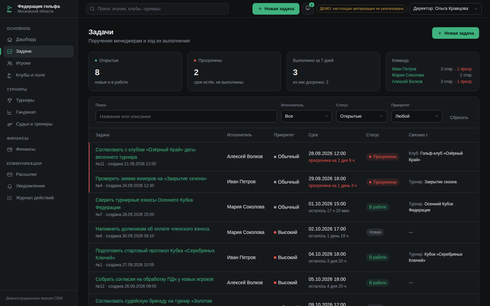
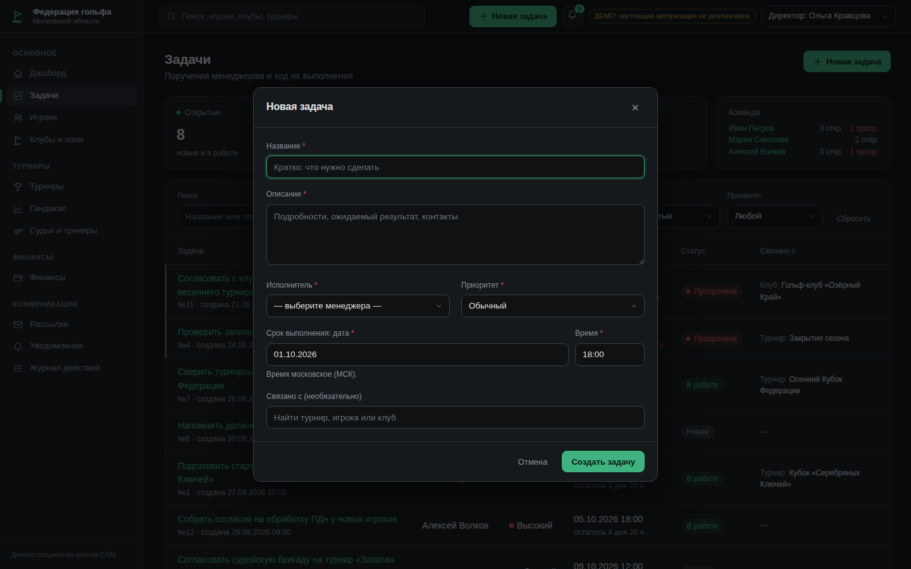
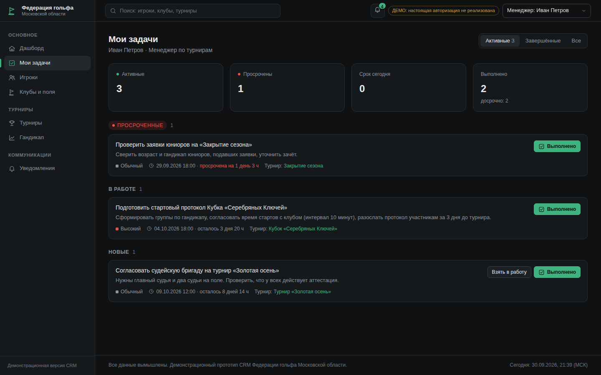

# Golf Federation of Moscow Oblast — CRM (demo)

A **presentation prototype** of a CRM for the Golf Federation of Moscow Oblast
(«Федерация гольфа Московской области»). The goal is to show in ~10 minutes what the
system looks like and what it can do. The UI is entirely in Russian. All data is
fictional («Все данные вымышлены»).

The interface is a calm, minimalist **dark** theme (one accent colour, no decoration), and the
director can assign **tasks** to managers and is notified as soon as a manager completes one.


> This is **not** a production system: there is no real authentication, payments and
> mailings are simulated, and the handicap calculation is a simplified demo version
> (see [Handicap](#handicap-simplified-demo-implementation)).

## Quick start

Requirements: **Python 3.11+**. No internet connection is needed at runtime: htmx and
Chart.js are stored in `app/static/vendor`, there are no CDN links or web fonts.

### Windows (PowerShell or cmd)

```bat
cd golf_crm
py -3.11 -m venv .venv
.venv\Scripts\activate
pip install -r requirements.txt
python run.py
```

### macOS / Linux

```bash
cd golf_crm
python3 -m venv .venv
source .venv/bin/activate
pip install -r requirements.txt
python run.py
```

`python run.py` creates `golf_crm.db` (SQLite) and fills it with demo data on the
first run, starts the server and opens <http://localhost:8000> in the browser.
Stop it with `Ctrl+C`.

> Upgrading from the previous version: an existing `golf_crm.db` keeps working (new tables and the
> demo users are created on start), but it has no demo tasks — run `python run.py --reset` once.

Options:

| Command | Effect |
|---|---|
| `python run.py --reset` | recreate the database with fresh demo data (do this before a presentation) |
| `python run.py --no-browser` | do not open the browser |
| `python run.py --port 8080` | use another port |
| `python seed.py` | only regenerate the database |

### Tests

```bash
python -m pytest -q
```

## Screens

| Section | What it shows |
|---|---|
| **Задачи** (director) | Counters (open, overdue, done in 7 days incl. early), per-manager workload, filters (search, assignee, status incl. derived "Просрочена", priority). A click on a row opens a slide-over with details, history and actions (edit, cancel). |
| **Мои задачи** (manager) | Own tasks grouped into Просроченные / В работе / Новые / Завершённые with a filter (active / done / all). One-click **«Взять в работу»** and **«Выполнено»** (also early); an optional completion comment in the slide-over. |
| **Уведомления** | Bell in the top bar with the unread counter and the latest 8 events; full list with "unread" filter and "mark all as read". New events pop up as toasts (polled every 20 s). |
| **Дашборд** | KPI cards (players, active, unpaid, upcoming tournaments, revenue for month/year), member count chart (12 months), handicap distribution (0–10/10–20/20–30/30+), top-5 clubs, upcoming tournaments, a "needs attention" block (overdue fees, referee certifications expiring/expired, tournaments that reached their limit). |
| **Игроки** | Table with search, filters (club, status, age category, handicap range), column sorting, pagination (live via htmx), CSV export of the current selection (UTF-8 with BOM, `;`, opens correctly in Excel). Player card with tabs: profile, handicap (index history chart, rounds with counted differentials, add round, recalculate), tournaments, payments, notes. Create / edit with validation, status change. |
| **Клубы и поля** | Club list, club card with contacts, players, courses and tee parameters (Course Rating / Slope / Par for white, yellow, blue, red tees), tournaments on its courses. |
| **Турниры** | List and monthly calendar. Tournament card: overview, registrations (confirm / waitlist / reject / mark fee paid; automatic waitlist when the limit is reached, automatic promotion when a slot frees up), result entry, automatic totals and positions, leaderboard with category standings. Printable start protocol (tee times, groups) and final protocol as separate print-styled pages. Status workflow: draft → registration → in progress → finished (or cancelled). |
| **Гандикап** | All players with stored vs. recalculated index, "needs recalculation" filter, bulk recalculation. Single-player recalculation lives in the player card. |
| **Финансы** | Payment list with filters and CSV export, debtors (current-year membership fee unpaid) with "mark as paid", monthly summary (stacked chart + table), new payment form. |
| **Судьи и тренеры** | List with filters by role, warnings for certifications that expire in less than 60 days or have expired, create / edit. |
| **Рассылки** | Segment selection (everyone, debtors, juniors, seniors, club X, participants of tournament Y), live recipient preview, simulated sending, history. |
| **Журнал действий** | Audit log with filters by user (demo role) and action type. |
| Header | «+ Новая задача» (director, every page) opens a centered modal; global search (players, clubs, tournaments) with a dropdown, current-user switcher and the badge «ДЕМО: настоящая авторизация не реализована». |

Screenshots are in [`docs/screenshots`](docs/screenshots):

| Task list (director) | New task modal | "Мои задачи" (manager) |
|---|---|---|
|  |  |  |

## Suggested 10-minute demo

0. **Tasks** (as «Директор: Ольга Кравцова»): press **+ Новая задача** in the top bar, submit empty to see inline errors, fill it in (e.g. assign to Иван Петров, link to a tournament) → toast «Задача создана». Switch the user to **Менеджер: Иван Петров** → the bell shows the new task, open **Мои задачи**, press **Выполнено** on it. Switch back to the director → a toast «Иван Петров выполнил задачу … — досрочно, на … раньше срока» appears and the bell counter grows.
1. **Dashboard**: the KPIs and the "Требует внимания" block.
2. **Игроки**: filter by "Не оплачен взнос", sort by handicap, export CSV and open it in Excel. Open a player → tab **Гандикап** (chart, counted rounds).
3. **Турниры → Осенний Кубок Федерации** (in progress): tab **Ввод результатов**, fill in a few round 2/3 scores → **Лидерборд** recalculates → **Промежуточный протокол** (print page) → **Завершить турнир** (rounds go to the handicap history).
4. **Турниры → Кубок «Серебряных Ключей»** (full, with waitlist): add an application → it goes to the waitlist; reject a confirmed player → the first waitlisted player is promoted.
5. **Финансы → Должники**: mark a fee as paid → the player's status becomes "Активен".
6. **Рассылки → Новая рассылка**: segment "Должники", see the preview (players without consent are excluded), "send".
7. **Журнал действий**: every step above is logged.
8. Switch the user to **Менеджер: Мария Соколова** (accountant access) in the header: the menu shrinks, player data becomes read-only.

Run `python run.py --reset` afterwards to restore the initial data.

## Demo users and roles

There is **no real authentication**: the current user is chosen in the header and stored in a
cookie. The UI shows the badge «ДЕМО: настоящая авторизация не реализована».

Each demo user maps onto one of the existing access roles, so the earlier role model keeps working:

| User (header) | Task system | Section access (role) |
|---|---|---|
| Директор: Ольга Кравцова | creates, edits and cancels tasks; sees all tasks; notified on start / completion / overdue | everything (admin), incl. mailings, referees/coaches, audit log |
| Менеджер: Иван Петров | own tasks («Мои задачи») | tournaments secretary: dashboard, players (edit), tournaments (edit), handicap, clubs (view) |
| Менеджер: Мария Соколова | own tasks | accountant: dashboard, finance (edit), players (read-only) |
| Менеджер: Алексей Волков | own tasks | same as the secretary role |

The legacy `role` cookie / `POST /role` endpoint still works and maps admin → director,
secretary → Иван Петров, accountant → Мария Соколова. Access is enforced on the server
(HTTP 403 page), not only by hiding menu items.

## Task system

- **Task**: title, description, creator, assignee (a manager), priority (low / normal / high),
  status (new / in_progress / done / cancelled), created / due / started / completed / cancelled
  timestamps, optional completion comment, optional link to a tournament, player or club.
  `is_early` (completed before the deadline) and **"overdue"** (open and past the deadline) are
  **computed, never stored**.
- **Notification**: recipient, type (task_assigned / task_started / task_completed /
  task_overdue / task_cancelled), task, text, time, read flag. Who is notified:
  new or reassigned task → assignee; started / completed → director; cancelled → assignee;
  overdue → both (once per task, created lazily when anyone polls).
- Every task action is written to the existing **audit log** with the user's name.
- The create / edit form is loaded by htmx into a centered modal (dimmed backdrop; closes with
  Esc, ×, "Отмена" or a backdrop click; focus is trapped and starts on the first field).
  Validation errors are rendered inline without closing it; on success the modal closes, a toast
  appears and lists refresh (`HX-Trigger: tasksChanged`). Without JavaScript the same form works
  as a normal page.
- Rules live in `app/services/tasks.py` (tested in `tests/test_tasks.py`).

## Design

- Dark theme only; all design tokens (surfaces, text, the single accent `#3fb27f`, status colours,
  chart palette, radii) are CSS variables at the top of `app/static/css/app.css`.
- System font stack, no web fonts, icons are inline SVG — the app works fully offline.
- Chart colours were checked with a palette validator for the dark surface (lightness band,
  colour-blind separation, contrast). The member-count chart uses a single axis (new members per
  month are in the tooltip).
- Print pages (start / final protocol) use a light "paper" variant and a print stylesheet.
- Layout: slim grouped sidebar (Основное, Турниры, Финансы, Коммуникации), thin top bar, one
  content column; a right-hand slide-over appears only for task details.

## Handicap: simplified demo implementation

`app/services/handicap.py` implements a **simplified demo calculation inspired by the
World Handicap System. It is NOT a certified calculation under R&A/USGA rules.**

- Differential = (113 / Slope) × (Adjusted Gross Score − Course Rating), rounded half up to 0.1.
- Index = average of the best 8 of the most recent 20 differentials.
- With fewer than 20 rounds: 3 → lowest − 2.0; 4 → lowest − 1.0; 5 → lowest; 6 → average of lowest 2 − 1.0;
  7–8 → lowest 2; 9–11 → lowest 3; 12–14 → lowest 4; 15–16 → lowest 5; 17–18 → lowest 6; 19 → lowest 7.
- Index is clamped to 0.0–54.0. Course handicap = Index × Slope / 113 + (Course Rating − Par).

Not implemented: hole-by-hole net double bogey adjustment (the entered gross is treated
as the adjusted gross score), Playing Conditions Calculation, soft/hard cap, exceptional
score reduction, 9-hole score combination, plus handicaps.

## Assumptions (Допущения)

Decisions made where the brief was silent:

1. **Location.** The repository already contained an unrelated project, so the CRM lives in the self-contained `golf_crm/` folder. Run all commands from inside it.
2. **Demo dates are relative to the first run.** The seed places tournaments, payments and rounds around "today" so there is always a tournament in progress, open registrations etc. The random seed is fixed (`config.SEED`), so the data is identical for a given run date.
3. **License number** `MO-<current year>-<NNNN>`: numbered by seniority in the seed; new players get the next free number. It never changes.
4. **Age category** is computed on today's date: juniors ≤ 17, seniors ≥ 50. For tournaments the category is computed on the tournament start date.
5. **Membership fee** is annual per calendar year (5 000 ₽ adults, 2 500 ₽ juniors and seniors — `app/config.py`). The invoice is issued on 15 January or on the join date, with a 30-day term. A player gets the status "Не оплачен взнос" when the current-year invoice is overdue; marking it paid restores "Активен". A new player automatically gets a current-year invoice. "Debtors" = current-year membership invoice pending or overdue. Pending invoices past their due date become overdue on application start.
6. **Registration limit.** Both "Заявка" and "Подтверждена" occupy a slot. When the limit is reached new applications go to the waitlist. When a slot frees up (reject / move to waitlist) or the limit is raised, the earliest waitlisted application becomes "Заявка". Registration is only possible while the tournament is "Регистрация открыта" and before the deadline; suspended players cannot register.
7. **Tournament fees.** An invoice is created with the application (not for the waitlist). Rejecting or waitlisting deletes an unpaid invoice; if the fee was already paid the UI asks to arrange a refund manually.
8. **Results** are entered only for confirmed players and only while the tournament is "Идёт". The course handicap is fixed at the first entry. Finishing the tournament locks results, posts every round to the players' handicap history and recalculates their indexes.
9. **Stableford** points are estimated from round totals (no hole-by-hole scores): `max(0, 36 + par + course handicap − gross)` per round.
10. **Ranking:** ties share a position (shown as "T5"); while a tournament is in progress players with more rounds played rank higher.
11. **Scoring category** priority: juniors → seniors → gender (if the tournament has such a category).
12. **Tees:** by default men play yellow and women red; in the seed, low handicappers (< 8) play white/blue. 9-hole courses carry ratings for 18 holes (two loops).
13. **Dates are typed as text in DD.MM.YYYY** (with an input mask) instead of native date pickers, because native pickers display the browser's locale format (e.g. MM/DD/YYYY).
14. **Clubs and courses are read-only** in the UI (seeded). Players and tournaments are never deleted through the UI (players are suspended, tournaments cancelled) to keep the audit trail consistent; the only deletion is an unpaid tournament invoice when its application is rejected.
15. **Audit "who"** is the demo user label (e.g. «Менеджер: Иван Петров»), since there are no real accounts. User switches are logged too.
16. **Mailings** only reach players with personal-data consent and an e-mail; excluded players are listed in the preview. Sending writes the message to the database, the audit log and `logs/mailings.log` (recipient list). Nothing is sent.
17. **Money** is stored in whole rubles.
18. **Styling:** one hand-written CSS file instead of Tailwind (no build step). The layout adapts to tablet width (collapsed icon sidebar) and phone width (hidden sidebar with a menu button, the demo badge becomes a strip under the top bar).
19. The server listens on `127.0.0.1` only.
20. **Moscow time everywhere.** All timestamps and "today" use Moscow time (UTC+3, fixed offset — Moscow has had no DST since 2014; a fixed offset avoids needing `tzdata` on Windows). Datetimes are stored without a time zone. Times are shown as HH:MM (24 h).
21. **Demo users** are a fixed set of four (one director, three managers) created automatically, also in databases created by the previous version. Only the director creates tasks; tasks can only be assigned to managers.
22. **Task deadline** must be in the future and at most one year ahead; the time is typed as HH:MM with a mask, like dates.
23. **One-button completion.** «Выполнено» completes the task immediately (no confirmation) from any open state — a manager may skip «Взять в работу»; then the start time equals the completion time. The optional comment is available in the task slide-over / page.
24. **Only open tasks can be edited or cancelled**, and only by the director. Changing the assignee resets the task to «Новая» and notifies both managers. Done tasks cannot be reopened.
25. **Notifications are in-app only** (no e-mail/SMS). The browser polls every 20 seconds; a toast is shown only for notifications that arrived after the page was first opened in that tab (tracked per user in `sessionStorage`), so old unread items do not flood the screen. Overdue notifications are created lazily on the next poll after the deadline passes.
26. **"Мои задачи"** groups tasks as Просроченные → В работе → Новые (by due date), with finished and cancelled tasks under a separate «Завершённые» filter. The director's list shows open tasks by default, overdue first.
27. **Seed tasks** are replayed through the same service functions (so notifications and audit entries are consistent). Notifications older than three days are marked as read.
28. **Charts:** the dual-axis member chart was replaced by a single-axis line (new members per month are shown in the tooltip) — two scales on one chart are hard to read.

## Project structure

```
golf_crm/
├── run.py                  # one-command start: create + seed DB, run server, open browser
├── seed.py                 # reproducible fictional demo data (Faker ru_RU, fixed seed)
├── requirements.txt
├── app/
│   ├── config.py           # fees, age limits, page size, seed, paths
│   ├── db.py               # SQLAlchemy engine/session, Cyrillic-aware SQLite helpers
│   ├── labels.py           # Russian UI labels for stored codes
│   ├── main.py             # FastAPI app, error pages, body size limit
│   ├── timeutil.py         # Moscow time helpers
│   ├── web.py              # templates, filters, demo users/access, nav groups, flash messages
│   ├── models/             # ORM models
│   ├── services/
│   │   ├── handicap.py     # differential, index, course handicap (simplified demo)
│   │   ├── leaderboard.py  # totals, positions, categories, boards
│   │   ├── registration.py # participant limit and waitlist
│   │   ├── segmentation.py # mailing segments
│   │   ├── payments.py     # fee amounts, mark paid, overdue refresh
│   │   ├── tournaments.py  # status transitions, posting rounds to handicap
│   │   ├── tasks.py        # task rules, notifications, derived overdue/early
│   │   ├── users.py        # demo users (director + managers) mapped to roles
│   │   ├── audit.py
│   │   └── formatting.py   # DD.MM.YYYY, "5 000 ₽", CSV for Excel
│   ├── routers/            # one module per section
│   ├── templates/          # Jinja2 templates (+ tasks/, notifications/, print/ for protocols)
│   └── static/             # css (all design tokens on top), js, vendor (htmx, Chart.js), favicon
├── tests/                  # pytest: services + HTTP-level tests
└── docs/screenshots/
```

## Security notes (demo level)

- All SQL goes through the SQLAlchemy ORM; Jinja2 autoescaping is on.
- Form bodies over 64 KB are rejected (HTTP 413); every text field has a length limit.
- CSV exports neutralise formula injection (`=`, `@`, …).
- There is no CSRF protection and no authentication — acceptable only for a local demo.
